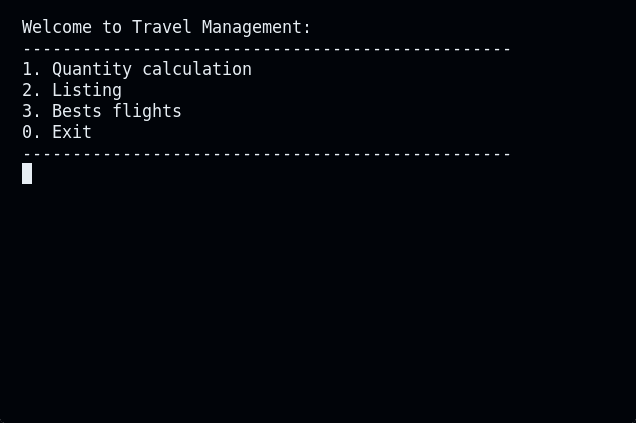

<a name="readme-top"></a>

[![Contributors][contributors-shield]][contributors-url]
[![Issues][issues-shield]][issues-url]

[![LinkedIn][linkedin-shield]][linkedin-url]

<br />
<div align="center">
  <a href="https://github.com/duardoliveiras/flight-path">
    
  </a>

  <h3 align="center">FlightPath</h3>

  <p align="center">
    A program made for study purposes, which uses a large database with several airports around the world and their routes.
    <br />
    <a href="https://github.com/duardoliveiras/flight-path/blob/main/docs/doxyfiles/latex/refman.pdf"><strong>Explore the docs »</strong></a>
    <br />
    <br />
    <a href="#examples">View Demo</a>
    ·
    <a href="https://github.com/duardoliveiras/flight-path/issues">Report Bug</a>
    ·
    <a href="https://github.com/duardoliveiras/flight-path/issues">Request Feature</a>
  </p>
</div>

<!-- TABLE OF CONTENTS -->
<details>
  <summary>Table of Contents</summary>
  <ol>
    <li>
      <a href="#about-the-project">About The Project</a>
      <ul>
        <li><a href="#built-with">Built With</a></li>
      </ul>
    </li>
    <li>
      <a href="#getting-started">Getting Started</a>
      <ul>
        <li><a href="#prerequisites">Prerequisites</a></li>
        <li><a href="#installation">Installation</a></li>
      </ul>
    </li>
    <li><a href="#usage">Usage</a></li>
    <li><a href="#examples">Examples</a></li>
        <ul>
            <li><a href="#max-path">Max Path</a></li>
            <li><a href="#ranking">Raking </a></li>
            <li><a href="#number-of-different-countries-accessible-from-an-airport">Different countries from an airport</a></li>
            <li><a href="#best-flights-with-filter">Best Flights with filter</a></li>
        </ul>
    <li><a href="#contact">Contact</a></li>
  </ol>
</details>

## About The Project

<div align="center">

</div>

**World Air Flight Analysis Program in C++**

We present an efficient program developed in C++, capable of reading a vast database containing information on more than 69 thousand connections between 3 thousand airports distributed across different countries.

**Graph Structure:**

The program uses a graph structure to represent connections between airports. Each node in the graph represents an airport, and the edges between the nodes represent the direct routes between these airports. This graphical representation facilitates the application of efficient algorithms for data analysis.

**Main Features:**

1. **Quantification:**
   - The program offers several quantification functions, allowing you to obtain detailed statistics on the number of flights, airports and connections in different regions of the world.
2. **Maximum and Minimum Path:**
   - Specialized algorithms find the maximum and minimum path between two airports, providing the longest and shortest routes available.
3. **Essential Points:**
   - Identifies essential points in the graph, that is, airports whose removal would make certain regions inaccessible.
4. **Airport Ranking:**
   - Generates a ranking of airports based on the number of flights.
5. **Flight Search:**
   - Offers advanced search options, allowing users to search for flights from specific airports, entire cities (considering all airports) or geographic coordinates. The maximum distance for analysis is user configurable, providing flexibility in the search.

### Built With

We use C++ to build the algorithms as efficiently as possible and we use Python to validate the results provided against the database.

- [![cpp]](https://cplusplus.com/)

<p align="right">(<a href="#readme-top">back to top</a>)</p>

<!-- GETTING STARTED -->

## Getting Started

### Prerequisites

Install cmake

```
sudo apt install cmake
```

### Installation

1. ` git clone link project`
2. `cd project`
3. `cd src`
4. Generating the Makefile from cmake (CMakeLists.txt)

```
$ cmake .
$ make
```

## Usage

There are two databases, the original with 69 thousand connections and the fake one which has only 23.

`./a fake ` to access fake db.

`./a original` or `./a` to access original db.

## Examples

#### Max Path:




#### Ranking


#### Number of different countries accessible from an airport


In this example we see that it is possible to access 7 different countries from GRU. But limiting it to one stop, we were able to access 5 countries.

#### Best Flights With Filter


Here we can see the search between a point on the map (it is calculated from all airports close to the point based on the maximum distance defined by the user).

We search between a coordinate and a city, using an airline filter.


## Contact

[Eduardo Silva](https://github.com/duardoliveiras) - duardodev@gmail.com

[Clarisse Carvalho ](https://github.com/MitsukiS16)

Project Link: [https://github.com/duardoliveiras/flight-path](https://github.com/duardoliveiras/flight-path)

<p align="right">(<a href="#readme-top">back to top</a>)</p>

[contributors-shield]: https://img.shields.io/github/contributors/duardoliveiras/flight-path.svg?style=for-the-badge
[contributors-url]: https://github.com/duardoliveiras/flight-path/graphs/contributors
[forks-shield]: https://img.shields.io/github/forks/duardoliveiras/flight-path.svg?style=for-the-badge
[forks-url]: https://github.com/duardoliveiras/flight-path/network/members
[stars-shield]: https://img.shields.io/github/stars/duardoliveiras/flight-path.svg?style=for-the-badge
[stars-url]: https://github.com/duardoliveiras/flight-path/stargazers
[issues-shield]: https://img.shields.io/github/issues/duardoliveiras/flight-path.svg?style=for-the-badge
[issues-url]: https://github.com/duardoliveiras/flight-path/issues
[linkedin-shield]: https://img.shields.io/badge/-LinkedIn-black.svg?style=for-the-badge&logo=linkedin&colorB=555
[linkedin-url]: https://linkedin.com/in/duardooliveiras
[cpp]: https://img.shields.io/badge/C++-00599C?style=flat-square&logo=C%2B%2B&logoColor=white
[python]: https://img.shields.io/badge/python-3670A0?style=for-the-badge&logo=python&logoColor=ffdd54
